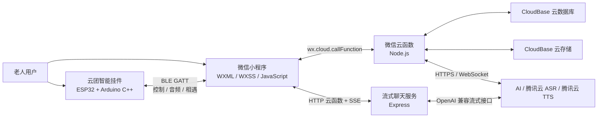
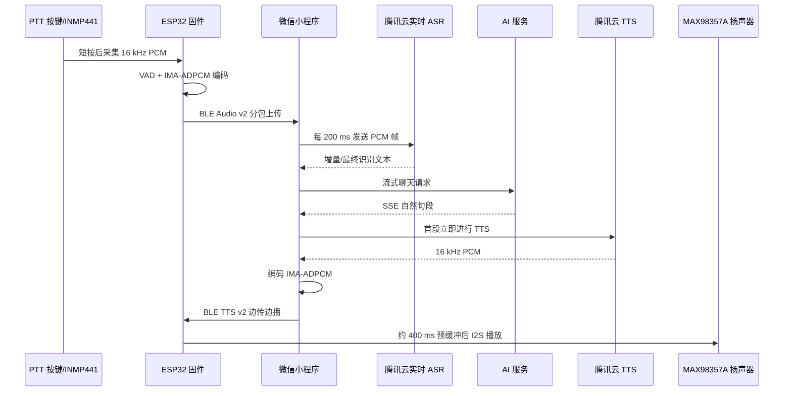

# 云团智能陪伴挂件内部技术文档

> 文档用途：项目组内部技术梳理、PPT 制作参考与部署交接，不作为对外发布稿  
> 文档属性：内部资料；制作 PPT 时应按受众删减，不建议整段照搬  
> 当前版本：小程序开发版 / 固件 `0.8.0` / 硬件 `A1`  
> 协议版本：控制协议 `1.7`，录音与语音播放协议 `v2`  
> 更新日期：2026-07-21

## 使用说明

本文是项目事实底稿，供团队成员统一技术口径、提取 PPT 内容和准备答辩材料。制作 PPT 时建议遵循以下原则：

- 先讲用户问题和系统价值，再讲架构、关键链路和工程实现；
- 每页只保留一个核心结论，正文尽量转化为架构图、流程图、时序图、截图或数据；
- “已经实现”“当前可演示”“仍需验证”和“后续规划”必须分开表述；
- 版本号、测试数量、性能数据和真机效果应在定稿前重新核对；
- 不在 PPT 中展示 API Key、OpenID、设备序列号、联系方式、社交 Token、原始录音等敏感信息。

第 1—8 节是技术事实与实现依据，第 9 节给出 PPT 组织参考，第 10 节列出当前边界，第 11 节提供取材与定稿检查清单。

## 1. 项目概述

“云团”是一套面向随迁老人的智能陪伴系统，由微信小程序、微信云开发后端、BLE 智能挂件和第三方 AI 语音服务共同组成。

产品交互只保留两个一级页面：

- **设备**：连接和管理挂件、查看电量、设置提醒、编辑个人名片、查看相遇记录以及管理隐私数据；
- **伙伴**：与 AI 对话、处理附近伙伴的招呼、查看已认识的朋友并进行文字聊天。

系统的核心价值不是单一功能，而是打通了“真实硬件感知—手机连接—云端智能—社交关系”的完整链路：

1. 挂件通过 BLE 与微信小程序通信；
2. 用户可通过手机麦克风或挂件 PTT 按键与 AI 语音对话；
3. 两个挂件在附近时可匿名发现彼此；
4. 用户主动同意后才能建立伙伴关系、聊天和交换联系方式；
5. 敏感凭据、AI 调用、关系判断和数据权限全部放在云端处理。

## 2. 系统总体架构



系统按职责分为四层：

| 层级 | 主要技术 | 主要职责 |
| --- | --- | --- |
| 挂件硬件层 | ESP32、Arduino C++、NimBLE、I2S、ADC、NVS | 按键、录音、扬声器、电量、提醒、附近感知和 BLE 通信 |
| 小程序交互层 | 微信小程序原生框架、WXML、WXSS、JavaScript | 页面交互、BLE 控制、本地缓存、流式渲染和状态展示 |
| 云开发业务层 | 微信云函数、Node.js、CloudBase 数据库与云存储 | AI 代理、身份确认、社交关系、消息、限流、幂等和数据删除 |
| 外部智能服务层 | OpenAI Chat Completions 兼容接口、腾讯云 ASR/TTS | 大模型回答、语音识别和语音合成 |

## 3. 核心技术栈

### 3.1 小程序端

- 微信小程序原生开发框架，基础库版本 `3.15.2`；
- WXML 负责页面结构，WXSS 负责适老化视觉样式，JavaScript 负责业务逻辑；
- `wx.openBluetoothAdapter`、`wx.createBLEConnection` 等微信 BLE API；
- `wx.cloud.callFunction` 调用普通云函数；
- `wx.cloud.callHTTPFunction` 与 SSE 分块接收流式 AI 回复；
- `wx.connectSocket` 连接腾讯云实时语音识别 WebSocket；
- `wx.getStorageSync/setStorageSync` 保存 AI 聊天、伙伴聊天缓存、相遇记录、设置和诊断事件；
- `wx.getRecorderManager` 支持直接使用手机麦克风说话。

### 3.2 云端

- 微信 CloudBase 云函数与云数据库；
- Node.js CommonJS 模块；
- `wx-server-sdk` 获取可信微信身份、访问数据库和云存储；
- Axios 调用 OpenAI Chat Completions 兼容的 AI 接口；
- Express 承载 HTTP 流式聊天云函数；
- 腾讯云 Node.js SDK 提供一句话 ASR 与 TTS；
- SHA-256 用于把 OpenID 转换为不可逆业务键和数据库文档键；
- 云数据库事务实现限流、请求幂等、关系建立和未读数更新。

### 3.3 挂件端

- Arduino C++ 固件；
- NimBLE-Arduino 实现 BLE Server、BLE Advertising 和附近设备扫描；
- ESP32 I2S 驱动连接 INMP441 数字麦克风和 MAX98357A 数字功放；
- ADC 读取锂电池分压；
- Preferences/NVS 保存提醒设置、社交模式和待确认的相遇事件；
- IMA-ADPCM 压缩 16 kHz 单声道语音，降低 BLE 传输数据量；
- CRC-16 校验控制帧，CRC-32 校验完整音频；
- 非阻塞状态机协调录音、BLE 上传、提示音和语音播放。

## 4. 各功能采用的技术

### 4.1 双页面适老化交互

小程序只保留“设备”和“伙伴”两个 Tab，减少老人寻找功能的层级。设备页只直接展示连接、电量、社交模式、震动、查找挂件和断开连接等日常信息与操作；设备型号、固件、硬件、协议和安全模式统一收进“开发者工具”。AI 对话、最近相遇、朋友和招呼集中在伙伴页。名片编辑、隐私说明、缓存与数据删除仍集中在设备页。

页面使用原生 WXML/WXSS，主页面标题提高到 `50rpx`，正文和说明文字主要使用 `28—34rpx`，关键按钮高度不低于 `96rpx`，并增加行距、留白和状态对比。设备 ID、RSSI、模拟设备、BLE 联调和诊断等非日常信息统一收进设备页底部的“开发者工具”入口。左右滑动切页由自定义手势模块实现，包含：

- 水平/垂直方向锁定，避免与页面滚动冲突；
- 位移和速度共同判断是否切页；
- 边界橡皮筋阻尼；
- `translate3d`、透明度和自定义缓动曲线；
- 离场与入场动画衔接。

关键实现：[app.json](../miniprogram/app.json)、[tab-swipe.js](../miniprogram/utils/tab-swipe.js)。

### 4.2 BLE 搜索、连接与自动重连

小程序通过微信 BLE API 搜索名称前缀为 `YT-` 的挂件。连接后发现标准服务和三个自定义 GATT 服务：

| GATT 服务 | 用途 |
| --- | --- |
| Battery Service `0x180F` | 电量读取与变化通知 |
| Device Information `0x180A` | 型号、序列号、固件和硬件版本 |
| Control Service | 状态查询、社交模式、查找挂件、时间同步和提醒设置 |
| Audio Service | 挂件录音上行 |
| TTS Service | 合成语音下行和播放状态 |

控制协议使用自定义二进制帧，包含起始字节、版本、命令、序号、标志、负载长度和 CRC-16。小程序通过 Sequence 匹配请求与响应，并提供命令超时和有限重试。

断线后采用 `1、3、5、10、15、30` 秒退避重连。最近一次连接成功的设备 ID 和广播名称保存在本机；连接使用系统 `deviceId`，界面只显示 BLE 广播名，避免把 Android MAC 地址或 iOS UUID 暴露为设备名称。

关键实现：[ble.js](../miniprogram/services/ble.js)、[yuntuan-device.js](../miniprogram/services/yuntuan-device.js)、[ble.js 配置](../miniprogram/config/ble.js)。

### 4.3 电池电量显示

电池通过 GPIO1 读取现有 100k/100k 分压中点，不要求修改已经焊接完成的硬件。实际电池电压约为 ADC 测量值的两倍。固件正常状态每 30 秒采样，初始化或异常确认阶段每 1 秒采样：

1. 先执行 3 次不参与计算的预采样，使高阻分压下的 ADC 内部采样电容稳定，再连续采集 15 个正式样本；
2. 排序后取中位数，过滤 BLE 和扬声器造成的瞬态噪声；
3. 连续 3 次处于合理电压范围后才确认电量有效；连续 3 次异常则标记为不可用；
4. 使用 `新值 1/4 + 历史值 3/4` 进行平滑，并用 2% 迟滞抑制数字来回跳动；
5. 通过 3.3 V—4.2 V 锂电池分段曲线换算为近似百分比；
6. 在录音、音频上传和播放时暂停采样，避免大电流压降造成误报；
7. 有效值通过标准 Battery Level 通知；自定义状态帧使用 `0xFF` 表示未知，防止启动时伪造 100%。

电量低于 20%、10% 和 5% 时分级产生低电量事件。小程序显示“约 xx%”、进度条和低电量提示；初始化阶段显示“电量读取中”，持续异常则显示“电量暂不可用”。分段曲线仍需用真机在满电、中段和低电量下的万用表数据进行最终标定。

关键实现：[main.cpp](../hard/main.cpp)、[yuntuan-device.js](../miniprogram/services/yuntuan-device.js)。

### 4.4 提醒与查找挂件

点击“提醒查找挂件”后，小程序向 Control Service 发送 `FIND_DEVICE` 命令。固件驱动：

- GPIO2 的振动马达；
- GPIO48 状态 LED；
- MAX98357A 扬声器播放带渐入渐出包络的 G5—E5 双音提示旋律。

“提醒查找挂件”始终同时震动、播放双音旋律并闪灯，不受社交震动开关影响。设备页只保留“社交模式”和“震动反馈”两个开关；附近相遇统一使用震动反馈，不播放社交提示音。震动开关通过 `SET_ALERT_SETTINGS` 同步到挂件，并使用 Preferences/NVS 持久化，挂件重启后仍然有效。BLE 协议继续保留三字节设置结构以兼容现有固件，但社交提醒总开关固定开启、社交声音字段固定关闭。

### 4.5 AI 文字聊天

AI 聊天采用“前端本地历史 + 云函数代理 AI”的结构：

- 页面完整记录只保存在本机，最多保存最近 50 条，不需要每次打开都从云函数读取；
- 请求 AI 时只携带最近 12 条、总计不超过 4000 字符的上下文；
- 单条用户消息最多 500 字符；
- API Key、模型名和接口地址只存放在云函数环境变量；
- 云函数加入面向老人的系统提示词，要求回答简短、自然、易懂，并禁止冒充医生进行诊断；
- AI 服务采用 OpenAI Chat Completions 兼容协议，因此可以通过环境变量切换不同供应商和模型。

普通模式由 `chat` 云函数一次性返回完整回答；流式模式由 `chat-stream` HTTP 云函数接收上游 SSE，并把首段约 16 字、后续约 40 字的自然句段立即发送给小程序。前端每 80 ms 合并一次页面更新，后续只更新当前 AI 消息字段，避免频繁重建整个消息数组。

如果 HTTP 云函数、分块接收或上游流式模式不可用，且页面尚未展示任何部分回复，客户端会自动降级到普通聊天云函数。

关键实现：[chat.js](../miniprogram/services/chat.js)、[chat 云函数](../cloudfunctions/chat/index.js)、[chat-stream](../cloudfunctions/chat-stream/index.js)、[stream-reply-renderer.js](../miniprogram/pages/chat/stream-reply-renderer.js)。

### 4.6 手机麦克风语音聊天

手机语音链路为：

```text
手机麦克风 → RecorderManager 录音 → Base64 → chat 云函数
→ 腾讯云一句话 ASR → 文本 → AI → 腾讯云 TTS → 挂件或页面反馈
```

手机录音使用微信 `RecorderManager`。录音文件由小程序读取为 Base64，再交给云函数调用腾讯云一句话识别。该模式不依赖挂件麦克风，适合没有连接硬件时使用。

### 4.7 挂件 PTT 实时语音聊天

挂件语音是项目中技术链最长的功能：



具体技术如下：

- INMP441 通过 I2S 采集 16 kHz、单声道语音；
- 20 ms 为一个采集帧，单次最多录音 15 秒；
- 使用简单 VAD 判断有效语音，连续静音约 800 ms 后自动结束；
- 固件将 PCM 压缩为 IMA-ADPCM，数据量约降为原来的四分之一；
- BLE Audio v2 使用 8 包滑动 ACK 窗口、超时重传、会话号和 CRC-32；
- 小程序边接收、边增量解码，并每 200 ms 向腾讯云实时 ASR 发送 PCM；
- 实时 ASR 失败时可回退到完整 WAV 一句话识别；
- AI 首个安全句段到达后立即发起 TTS，不等待全文完成；
- TTS 得到的 16 kHz PCM 再编码为 IMA-ADPCM，经 Write Without Response 下发；
- 挂件预缓冲约 400 ms 后开始播放，同时继续接收后续分包；
- 页面隐藏或切换到设备页时会停止处理当前页面的挂件语音任务，避免后台误触发 AI。

关键实现：[yuntuan-audio.js](../miniprogram/services/yuntuan-audio.js)、[yuntuan-realtime-asr.js](../miniprogram/services/yuntuan-realtime-asr.js)、[yuntuan-tts.js](../miniprogram/services/yuntuan-tts.js)、[main.cpp](../hard/main.cpp)。

### 4.8 设备间匿名相遇

开启社交模式后，挂件一边广播匿名社交 Beacon，一边扫描其他云团挂件。固件使用随机 32 位 Token，不广播 OpenID、姓名、联系方式、设备序列号或精确位置。

附近判断不是单次 RSSI 命中，而是：

- 进入阈值约 `-65 dBm`；
- 离开阈值约 `-72 dBm`，通过迟滞避免边缘反复触发；
- 连续 3 次满足条件才确认相遇；
- 同一对象有 60 秒冷却；
- 相遇事件写入最多 20 条的 NVS 队列；
- 通过应用层 ACK 确认小程序已经收到，失败按 1.5—30 秒退避重传。

挂件把对方 Token 交给已连接的小程序。小程序再通过 `social` 云函数解析公开名片。Token 默认最多保留 7 天，解析受到频率限制。已经认识或已屏蔽的用户不会再次获得打招呼凭证。

本机最多保存最近 30 次相遇。展示时按稳定伙伴键聚合，同一个人只显示一张卡片并累计相遇次数。

### 4.9 招呼、建立伙伴关系与伙伴聊天

陌生用户只能凭一次匿名相遇产生的交互凭证打招呼。对方明确点击“认识 TA”后，云端才会建立双向伙伴关系和一对一会话。

伙伴聊天使用 CloudBase 数据库作为可信数据源，并采用以下技术：

- 云函数从微信上下文获取 OpenID，小程序不能伪造发送者；
- 对 OpenID 做 SHA-256 后再作为业务 OwnerKey；
- 会话成员校验，非双方成员不能读取消息；
- 稳定 `requestId` 保证网络重试不会重复发送；
- 数据库事务维护消息、最后摘要和未读数；
- 每分钟最多 12 条、每天最多 200 条消息；
- 招呼发起方在对方回复前最多发送 3 条；
- 服务端拒绝网址以及绕过联系方式交换流程直接粘贴的手机号、微信号；
- 支持解除关系、屏蔽、举报和仅清空自己这一侧的显示记录。

聊天页面会先显示本机缓存，再进行增量同步：

- 本机最多缓存 12 个会话、每个会话最近 100 条；
- 首次云端加载每页 30 条；
- 使用 `beforeCreatedAt` 分页加载更早消息；
- 使用 `afterCreatedAt` 只读取最后一条本地消息之后的新消息；
- 前台轮询从 5 秒逐步放慢到 30 秒，发现新消息后恢复最快频率；
- 页面进入后台后停止轮询，减少云数据库读取量。

关键实现：[social-chat-cache.js](../miniprogram/services/social-chat-cache.js)、[social-chat.js](../miniprogram/pages/social-chat/social-chat.js)、[social 云函数](../cloudfunctions/social/index.js)。

### 4.10 个人名片、头像和联系方式

公开名片包含昵称、头像、一句话介绍、最多三个兴趣标签和社交意愿。自定义头像上传到 CloudBase 云存储，名片元数据由 `social` 云函数写入数据库。

联系方式采用“申请—同意—主动选择分享”的三步机制：

1. 一方申请交换；
2. 对方明确同意；
3. 双方分别从本机私密预设中选择要分享的内容。

微信号、手机号和二维码预设默认只保存在当前手机，不进入公开名片。二维码只有在用户确认分享时才上传。网络重试使用稳定请求编号避免重复记录；未完成分享的临时二维码在 24 小时后清理。

### 4.11 本地缓存与增量同步

项目根据数据性质采用不同存储策略：

| 数据 | 存储位置 | 策略 |
| --- | --- | --- |
| AI 完整聊天历史 | 小程序本机 | 最近 50 条，600 ms 防抖写入，不从云端拉历史 |
| AI 幂等与用量 | `chat_usage` | 不可逆用户键，保存限流状态和最近请求结果 |
| 伙伴聊天 | 云数据库 + 本机缓存 | 云端为准，本机先展示，之后增量同步 |
| 相遇记录 | 小程序本机 | 最近 30 次，按同一伙伴聚合展示 |
| 提醒设置 | 小程序本机 + 挂件 NVS | 修改后同步到硬件并持久化 |
| 私密联系方式预设 | 小程序本机 | 未主动分享前不上云 |
| 公开名片和关系 | 云数据库 | 仅通过云函数访问 |

### 4.12 隐私、安全与数据删除

项目采用以下安全措施：

- AI API Key、ASR/TTS 密钥只存在云函数环境变量；
- 小程序不能直接读写社交数据库集合；
- OpenID 不返回客户端，云端使用不可逆哈希业务键；
- AI 输入、上下文、回复均限制长度，并拒绝客户端传入 `system` 角色；
- 聊天、语音识别和语音合成分别进行分钟级限流与每日配额；
- 上游 AI 错误日志只保存状态码、白名单错误码和请求编号，不记录原始响应正文；
- 真机诊断会过滤聊天正文、录音、联系方式、OpenID、序列号和社交 Token；
- “删除全部个人数据”会删除社交名片、关系、消息、二维码文件以及 AI 用量/幂等数据，然后清理本机缓存；
- `social-cleanup` 每天凌晨 3 点物理清理过期 Token、相遇凭证、临时二维码和历史关系数据。

当前固件 `SECURITY_MODE=0` 属于实验室联调模式，尚未启用量产级会话认证与链路加密。这一点在成果展示时应明确说明。

### 4.13 真机诊断与可维护性

小程序本机最多保存最近 160 条脱敏诊断事件，包括 BLE 阶段、语音阶段、云函数耗时和首包播放耗时。“开发者工具”页可以生成可复制的真机诊断报告。

项目还提供 Mock 挂件和单人社交测试伙伴，使开发者在缺少第二台硬件或第二个微信账号时仍能验证大部分业务流程。

## 5. 云数据库与云存储设计

主要集合如下：

| 集合 | 用途 |
| --- | --- |
| `chat_usage` | AI/ASR/TTS 限流、每日额度和请求幂等 |
| `social_profiles` | 公开社交名片 |
| `social_tokens` | 临时匿名 Token 到名片的映射 |
| `social_resolve_usage` | Token 解析频率限制 |
| `social_encounter_refs` | 相遇产生的短期互动凭证 |
| `social_greetings` | 招呼及接受/拒绝状态 |
| `social_matches` | 双向伙伴关系、未读数和会话摘要 |
| `social_conversations` | 一对一会话 |
| `social_messages` | 伙伴文字消息 |
| `social_contact_requests` | 联系方式交换申请 |
| `social_contacts` | 双方主动分享的联系方式快照 |
| `social_contact_files` | 二维码文件归属和生命周期 |
| `social_blocks` | 屏蔽关系 |
| `social_reports` | 举报内容快照和处理状态 |

消息增量查询依赖 `social_messages(conversationId asc, createdAt desc)` 组合索引。完整索引清单见项目 README，关键索引机器可读清单见 [required-indexes.json](../database/required-indexes.json)。

云存储主要保存公开名片头像和用户主动分享的联系方式二维码；云数据库只保存对应的 Cloud File ID 和归属记录。

## 6. 后端模式与部署方式

小程序页面只依赖 Service 层，不直接感知后端实现。当前支持：

- `mock`：本地模拟数据；
- `cloud`：微信云函数和云数据库；
- `http`：预留自建 HTTPS 服务；
- `ble`：设备业务直连真实挂件。

当前开发版、体验版和正式版配置统一指向固定 CloudBase 环境 `cloudbase-d7g2y0azb4f5dcf00`，聊天使用云函数，设备使用本机 BLE。

需要部署的云函数：

| 云函数 | 类型 | 作用 |
| --- | --- | --- |
| `chat` | 普通云函数 | AI 普通回复、ASR、TTS、配额与删除聊天数据 |
| `chat-stream` | HTTP 云函数 | AI 流式回复和 SSE 分段 |
| `social` | 普通云函数 | 名片、相遇解析、招呼、关系、消息和联系方式 |
| `social-cleanup` | 定时云函数 | 每日数据生命周期清理 |
| `device` | 普通云函数 | 保留的云端设备 Mock/扩展接口，真实设备走 BLE |

主要环境变量：

- AI：`AI_API_URL`、`AI_API_KEY`、`AI_MODEL`；
- ASR：`ASR_APP_ID`、`ASR_SECRET_ID`、`ASR_SECRET_KEY`、可选 Region/Engine；
- TTS：`TTS_SECRET_ID`、`TTS_SECRET_KEY`、`TTS_REGION`、`TTS_VOICE_TYPE`、`TTS_SPEED`、`TTS_VOLUME`；
- 限流：`CHAT_RATE_*`、`CHAT_DAILY_CHAT_QUOTA`、`CHAT_DAILY_ASR_QUOTA`、`CHAT_DAILY_TTS_QUOTA`。

## 7. 硬件接口约束

A1 版本已经焊接的引脚属于硬件契约，代码重构时不得修改：

| 功能 | GPIO |
| --- | ---: |
| PTT 按键，低电平有效 | 8 |
| 蜂鸣器/振动马达 | 2 |
| 外接状态 LED | 48 |
| 电池 ADC | 1 |
| INMP441 BCLK | 9 |
| INMP441 WS | 46 |
| INMP441 SD | 4 |
| MAX98357A DIN | 10 |

麦克风和扬声器共用 BCLK/WS 的 I2S 总线。自动测试会检查这些引脚，防止烧录时再次发生软件定义与实物不一致。

## 8. 测试与质量保证

项目当前包含 38 个 Node.js 回归测试文件，覆盖：

- BLE 协议、模拟挂件、电量、查找挂件和固定引脚；
- 录音状态机、实时 ASR、TTS 边收边播和语音链路；
- AI 输入保护、幂等、流式解析、降级和本地聊天历史；
- 社交名片、头像、附近相遇、招呼可靠性、伙伴消息和本地缓存；
- 页面生命周期、后台停止任务、红点轮询和左右滑动；
- 数据库关键索引、隐私删除和诊断脱敏。

截至本文更新时，全部 38 个测试均已通过。常用回归命令：

```powershell
Get-ChildItem tests\*_test.js | ForEach-Object { node $_.FullName }
```

真机测试还应覆盖：Android/iOS BLE 差异、不同微信版本、弱网、低电量、断线重连、环境噪声和不同外壳下的 RSSI 表现。

## 9. PPT 内容组织参考

本节用于帮助内部成员把技术事实拆成 PPT 页面，不是固定模板。最终页数应根据汇报时长和听众背景调整。

### 9.1 推荐页面结构

| 建议页 | 页面主题 | 本页只讲的核心结论 | 推荐素材 |
| ---: | --- | --- | --- |
| 1 | 项目定位 | 云团通过“挂件 + 小程序 + 云端 AI”连接陪伴、提醒与线下社交 | 产品名称、挂件照片、两张主页面截图 |
| 2 | 用户问题与设计目标 | 面向随迁老人，交互必须简单、可感知、低学习成本，并兼顾隐私 | 目标用户场景、问题—方案对照图 |
| 3 | 产品功能全景 | 产品只保留“设备”和“伙伴”两个一级页面，但覆盖设备、AI 与社交三类能力 | 信息架构图、两页界面拼图 |
| 4 | 系统总体架构 | 微信小程序连接真实硬件，云函数负责可信身份、业务逻辑和 AI 代理 | 第 2 节四层架构图 |
| 5 | BLE 与设备控制 | 自研控制协议统一承载状态、电量、提醒、查找和时间同步 | GATT 服务图、连接状态截图、协议帧示意 |
| 6 | 低延迟语音链路 | 录音、识别、AI、合成与播放分段重叠执行，减少整链路等待 | 第 4.7 节时序图、PTT 真机照片、阶段耗时图 |
| 7 | 匿名相遇机制 | 挂件只广播临时 Token，通过阈值迟滞、连续命中和 ACK 重传提高可靠性 | 相遇流程图、RSSI 阈值图、相遇卡片截图 |
| 8 | 主动社交与隐私 | 建立关系和交换联系方式都需要用户明确同意，敏感判断放在云端 | 双向确认流程图、隐私工具截图 |
| 9 | 数据与后端设计 | 云端为关系和消息的可信数据源，本地缓存负责快速展示和弱网体验 | 数据集合分组图、缓存/增量同步流程图 |
| 10 | 工程质量 | 回归测试、幂等、限流、诊断脱敏和数据清理共同保证可维护性 | 测试结果截图、诊断报告样例、质量清单 |
| 11 | 当前完成度 | 清楚区分已实现能力、可演示能力、待真机验证项和量产前工作 | 四象限或状态表，引用第 10 节 |
| 12 | 总结 | 技术价值在于打通硬件感知、移动端、云端智能和可信社交的完整链路 | 四个技术亮点与一张总览图 |

### 9.2 建议统一的技术亮点表述

- **软硬件一体化**：自研 BLE 控制、录音和语音播放协议，把 ESP32 挂件稳定接入微信小程序；
- **流式语音体验**：录音、ASR、AI、TTS 和播放分段重叠执行，并设计实时链路失败后的回退路径；
- **隐私优先的线下社交**：设备间使用临时匿名 Token 相遇，只有双方主动确认后才建立关系和交换联系方式；
- **完整工程保护**：本地优先缓存、增量同步、请求幂等、限流、诊断脱敏和数据生命周期形成端到端保护。

### 9.3 PPT 素材准备建议

1. 产品页准备挂件正反面照片、佩戴场景图以及“设备/伙伴”两张主页面截图；
2. 架构页优先重绘第 2 节 Mermaid 图，保留硬件、小程序、云函数、数据库和外部 AI 五类节点；
3. 语音页记录一次真实 PTT 链路的阶段耗时，至少包含录音结束、首个 ASR 文本、AI 首段、TTS 首包和开始播放；
4. 相遇页准备两台挂件靠近后的相遇记录截图，并用示意图解释 Token、RSSI 判定和用户确认；
5. 质量页保留最新自动化测试结果和真机测试记录，不使用过期截图；
6. 边界页直接引用第 10 节，不把尚未完成的 OTA、量产安全和系统级消息推送写成现有能力。

## 10. 当前边界与后续优化

以下能力当前尚未达到量产状态：

- 固件 OTA 尚未实现；
- 控制协议仍为安全模式 0，未启用量产级会话认证；
- RSSI 距离阈值需要结合最终外壳和佩戴方式重新标定；
- AI、ASR 和 TTS 依赖网络及云端密钥配置，离线时不能完成智能语音对话；
- 正式上线前仍需完成硬件功耗、充电保护、EMC、长期稳定性和多机并发测试；
- 数据量增长前必须在实际 CloudBase 环境核对全部组合索引和定时清理触发器；
- 伙伴消息目前依靠前台增量轮询，不提供小程序关闭后的系统级消息推送。

这些边界不影响当前原型验证，但在 PPT、答辩材料和量产计划中必须与“已经实现”的功能明确区分。

## 11. PPT 取材与定稿检查清单

### 11.1 代码与资料索引

| 主题 | 主要参考位置 |
| --- | --- |
| 小程序页面与交互 | `miniprogram/pages/`、`miniprogram/services/`、`miniprogram/utils/tab-swipe.js` |
| BLE 配置与设备服务 | `miniprogram/config/ble.js`、`miniprogram/services/ble.js`、`miniprogram/services/yuntuan-device.js` |
| 录音、实时 ASR 与 TTS | `miniprogram/services/yuntuan-audio.js`、`yuntuan-realtime-asr.js`、`yuntuan-tts.js` |
| 固件、引脚与状态机 | `hard/main.cpp` |
| AI 与流式聊天 | `cloudfunctions/chat/`、`cloudfunctions/chat-stream/`、`miniprogram/pages/chat/` |
| 社交关系与消息 | `cloudfunctions/social/`、`miniprogram/pages/social-chat/`、`social-chat-cache.js` |
| 数据库索引 | `database/required-indexes.json` |
| 自动化测试 | `tests/*_test.js` |
| 详细协议资料 | `docs/YUNTUAN_BLE_PROTOCOL_REVIEW_V0.2.md`、`docs/YUNTUAN_BLE_AUDIO_TRANSFER_V0.3.md`、`docs/YUNTUAN_BLE_SPEECH_PLAYBACK_V0.4.md` |

### 11.2 定稿前必须复核

- [ ] 小程序、固件、硬件和协议版本与实际演示设备一致；
- [ ] 自动化测试数量和通过状态使用最新一次运行结果；
- [ ] PPT 中出现的时延、成功率、功耗、距离等数字均有真实测试记录；
- [ ] 截图中不包含 OpenID、Token、联系方式、密钥、序列号或测试人员隐私；
- [ ] 所有架构图、流程图和时序图与当前代码链路一致；
- [ ] “已实现”“可演示”“待验证”“后续规划”使用统一状态标识；
- [ ] 演示顺序、设备编号、网络环境和云端密钥已在现场前完成检查。
